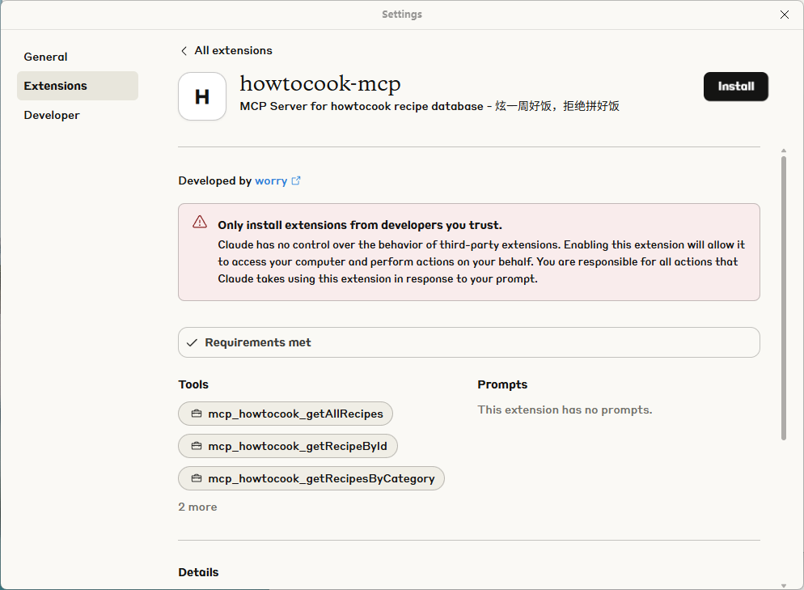

# 🍳 HowToCook-MCP Server 🥘 -- Plan Your Weekly Meals, No More Daily Struggles

English | [简体中文](./README.md)

> Turn your AI assistant into a personal chef that helps plan your daily meals!

An MCP (Model Context Protocol) server based on [Anduin2017/HowToCook](https://github.com/Anduin2017/HowToCook), allowing AI assistants to recommend recipes, plan meals, and solve the age-old question of "what should I eat today?"

Data Source: [Anduin2017/HowToCook](https://github.com/Anduin2017/HowToCook) ⭐ Don't forget to star the repo if you haven't already!

🎉 **Want to use MCP right away? Try it now** [https://howtocookmcp.weilei.site/](https://howtocookmcp.weilei.site/)

🎉 **At the same time, we also provide DXT (Desktop Extensions) for everyone to experience, one-click installation to Claude Desktop**

As follows: Please make sure you have installed the latest version of Claude Desktop. The current MCP DXT file has been uploaded to the code library. You can download it yourself or fork this repository to build it yourself




How to package local development into DXT?

1. Run `npm install -g @anthropic-ai/dxt`

2. In the folder containing the local MCP server, run `dxt init`. That is, the root directory of your MCP. This command will guide you to create `manifest.json`

3. Run `dxt pack` to create a dxt file

Now, any application that supports DXT can run your local MCP server. For example, opening the file with Claude for macOS and Windows will display the installation dialog

For more information, see: [anthropics/dxt](https://github.com/anthropics/dxt)

## 📸 Preview


## 🔌 Supported MCP Clients

This server works with all AI assistants and clients that support the MCP protocol, including but not limited to:

- 🤖 Claude Desktop App
- 📝 Cursor
- 💼 Other MCP-compatible clients

## ✨ Delicious Features

This MCP server provides the following culinary tools:

1. **📚 Query All Recipes** - Access all available recipe data, your complete cooking encyclopedia -- Use with caution due to large context size
2. **🔍 Query Recipes by Category** - Filter recipes by category: seafood, breakfast, meat dishes, staple foods, and more!
3. **🧩 Smart Meal Planning** - Get a full week's meal plan based on dietary restrictions, allergies, and number of diners
4. **🎲 Don't Know What to Eat?** - Perfect for the indecisive! Get instant menu recommendations based on party size
5. **🔎 Query Specific Recipe** - Search for specific recipes by name or ID, supports both exact and fuzzy matching to save tokens

## 🚀 Quick Start

### 📋 Prerequisites

- Node.js 16.0.0+ 🟢
- npm or yarn 📦

### 💻 Installation

1. Clone the repository

```bash
git clone https://github.com/worryzyy/howtocook-mcp.git
cd howtocook-mcp
```

2. Install dependencies (as simple as preparing ingredients!)

```bash
npm install
```

3. Build the code (the cooking process...)

```bash
npm run build
```

## 🍽️ Getting Started

### 🔥 Start the Server

```bash
npm start
```

### 🔧 Configure MCP Clients

#### It is recommended to use Cursor for quick experience (two methods)Cursor Configuration

1. Using npm package: Please run `npm i -g howtocook-mcp` first, otherwise `Failed to create client` will appear

Then add the MCP server configuration in Cursor settings:

```json
{
	"mcpServers": {
		"howtocook-mcp": {
			"command": "npx",
			"args": ["-y", "howtocook-mcp"]
		}
	}
}
```

2. If running from a local cloned repository, use this configuration:

```json
{
	"mcpServers": {
		"howtocook-mcp": {
			"command": "node",
			"args": ["yourpath\\howtocook-mcp\\build\\index.js"]
		}
	}
}
```

#### Other MCP Clients

For other clients supporting the MCP protocol, refer to their respective documentation. Generally, you'll need to specify:

- Server name: `howtocook-mcp`
- Command: `npx -y howtocook-mcp`

3. Restart the client to activate the culinary magic ✨

## 🧙‍♂️ Culinary Magic Usage Guide

Here are example prompts for using these tools in MCP clients:

### 1. 📚 Query All Recipes

No parameters needed, just summon the culinary encyclopedia!

```
Please use the howtocook MCP service to query all recipes
```

### 2. 🔍 Query Recipes by Category

```
Please use the howtocook MCP service to query seafood recipes
```

Parameters:

- `category`: Recipe category (seafood, breakfast, meat dishes, staple foods, etc.)

### 3. 🧩 Smart Meal Planning

```
Please use the howtocook MCP service to recommend a weekly meal plan for 3 people. We don't eat cilantro and are allergic to shrimp.
```

Parameters:

- `allergies`: List of allergens, e.g., ["garlic", "shrimp"]
- `avoidItems`: Dietary restrictions, e.g., ["green onion", "ginger"]
- `peopleCount`: Number of diners (1-10)

### 4. 🎲 What to Eat Today?

```
Please use the howtocook MCP service to recommend a dinner menu for 4 people
```

Parameters:

- `peopleCount`: Number of diners (1-10)

### 5. 🔎 Query Specific Recipe

```
Please use the howtocook MCP service to query the recipe for "Kung Pao Chicken"
```

Parameters:

- `recipeId`: Recipe name or ID to search for

## 📝 Tips

- This package is published on npm and can be installed globally via `npm install -g howtocook-mcp`
- Compatible with all AI assistants and applications that support the MCP protocol
- On first use, AI may need some time to familiarize itself with these tools (like preheating an oven)

## 🤝 Contributing

Forks and Pull Requests are welcome! Let's improve this culinary assistant together!

## 📄 License

MIT License - Feel free to use, just like sharing your favorite recipes!

---

> 🍴 The feast is about to begin, is your appetite ready?
